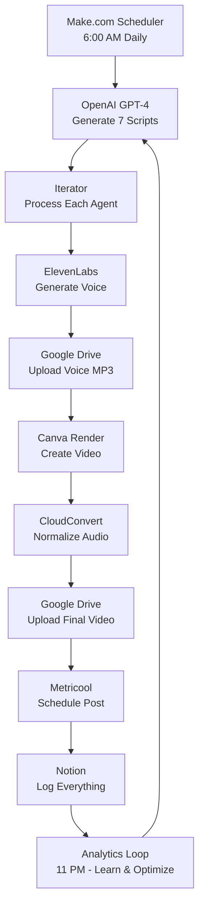

# 🎬 Group7 AI Video Factory

**The world's first fully automated, self-learning viral video production system**

[]()
[]()
[]()

---

## 🌟 What Is This?

Group7 AI Video Factory is a **complete end-to-end automation system** that:

- 📝 **Writes viral scripts** using GPT-4 (AI trend psychology + 2025 social media algorithms)
- 🎙️ **Generates voiceovers** with ElevenLabs (6 unique voices, 7 AI agents)
- 🎨 **Renders professional videos** in Canva (1080x1920 vertical, brand-consistent)
- 🎵 **Normalizes audio** to industry standard (-14 LUFS for TikTok/IG/YT)
- 📱 **Auto-posts to social media** via Metricool (TikTok, Instagram, YouTube)
- 📊 **Logs everything** in Notion with full analytics tracking
- 🧠 **Learns from performance** to optimize future content (AI feedback loop)

**Produces:** 7 videos/day, 210/month, 2,520/year
**Time Investment:** 5 min/day monitoring (vs 20+ hours/week manual production)
**Cost:** ~$5-6/day (~$0.80/video) vs $50-200/video for freelancers

---

## ⚡ Quick Start

```bash
# 1. Clone/navigate to project
cd /Users/davidmikulis/neuro-pilot-ai/Group7

# 2. Install dependencies
npm install

# 3. Copy environment template
cp GROUP7_ENV_TEMPLATE.env .env

# 4. Add your API keys to .env
nano .env  # Fill in all API keys

# 5. Start Canva render service
npm run dev

# 6. Follow deployment guide
open DEPLOYMENT_GUIDE.md
```

**Total setup time:** 2-3 hours for first deployment

---

## 📁 Project Structure

```
Group7/
├── README.md                           ← You are here
├── SYSTEM_READY.md                     ← System overview & status
├── DEPLOYMENT_GUIDE.md                 ← Step-by-step setup (START HERE)
├── QUICK_REFERENCE.md                  ← Daily operations cheat sheet
│
├── GROUP7_ENV_TEMPLATE.env             ← Environment variables (150+ settings)
├── package.json                        ← Node.js dependencies
├── .env                                ← Your secrets (create from template)
│
├── MAKECOM_VIDEO_FACTORY_SCENARIO.json ← Make.com workflow blueprint
├── canva-render-service.ts             ← TypeScript server for Canva
├── canva-render-service-test.sh        ← Test suite for Canva service
│
├── VOICE_SETTINGS_TABLE.json           ← ElevenLabs voice configs
├── CANVA_DATA_SCHEMA.csv               ← Sample data for 7 agents
├── CANVA_SCHEMA_DOCS.md                ← CSV documentation
│
├── OPENAI_PROMPTS.json                 ← GPT-4 prompts (scripts + analytics)
├── METRICOOL_API_PAYLOADS.json         ← Social posting configurations
├── CLOUDCONVERT_TEMPLATES.json         ← Audio normalization templates
├── NOTION_DATABASE_SCHEMAS.json        ← 4 database schemas + API payloads
│
├── retry-idempotency-module.ts         ← Fault-tolerant retry logic
└── TESTING_DATASET.json                ← Complete test data
```

---

## 🎯 The 7 AI Agents

Each agent has a **unique persona, voice, and content focus**:

| Agent | Role | Voice | Content Focus |
|-------|------|-------|---------------|
| 🔮 **Lyra** | Strategic Orchestrator | Rachel (authoritative female) | Leadership, vision, big-picture strategy |
| ⚡ **Atlas** | Infrastructure Expert | Adam (solid male) | Scaling, DevOps, system architecture |
| 🚀 **Nova** | Innovation Catalyst | Domi (energetic female) | Product innovation, rapid prototyping |
| 🔒 **Cipher** | Security Guardian | Adam (deeper male) | Cybersecurity, privacy, AI safety |
| 💬 **Echo** | Communication Specialist | Bella (warm female) | Remote work, async collaboration |
| 🔮 **Quantum** | Analytics Visionary | Callum (analytical male) | Data science, predictions, trends |
| 🔗 **Nexus** | Integration Architect | George (systematic male) | Workflow automation, API integration |

---

## 🧱 System Architecture



---

## 📦 Technology Stack

| Category | Tools |
|----------|-------|
| **Orchestration** | Make.com (15-module workflow) |
| **Script Generation** | OpenAI GPT-4 Turbo |
| **Voice Synthesis** | ElevenLabs (Turbo v2.5) |
| **Video Rendering** | Canva Pro + Developer App |
| **Audio Processing** | CloudConvert (normalize to -14 LUFS) |
| **Storage** | Google Drive (2TB) |
| **Social Posting** | Metricool (TikTok, Instagram, YouTube) |
| **Analytics & Logging** | Notion (4 databases) |
| **Backend** | Node.js 18+, TypeScript, Express |

---

## 📊 Performance Metrics (Expected)

**After 30 Days:**

| Metric | Value |
|--------|-------|
| Total Videos Produced | 210 |
| Total Views | 50k - 1M+ |
| Average Engagement Rate | 7-12% |
| Total Followers Gained | 500 - 10,000 |
| Time Saved vs Manual | 80+ hours |
| Cost per Video | $0.71 - $0.80 |

**ROI:** System pays for itself in saved labor within 1 week.

---

## 💰 Monthly Cost Breakdown

| Service | Cost | Notes |
|---------|------|-------|
| OpenAI | $20-40 | ~200k tokens (scripts + analytics) |
| ElevenLabs | $22 | 500k chars = 210 videos |
| Canva Pro | $15 | Unlimited templates |
| Google Workspace | $12 | 2TB Drive |
| Notion | $10 | Unlimited databases |
| Make.com | $29 | 10k operations |
| CloudConvert | $10 | 210 conversions |
| Metricool | $30 | Multi-platform scheduling |
| **Total** | **$148-168** | **~$5-6/day** |

---

## 🚀 Deployment Workflow

### **Phase 1: Setup (2-3 hours)**
1. Install dependencies (`npm install`)
2. Configure `.env` with all API keys
3. Create Notion databases (4 total)
4. Set up Google Drive folders
5. Design Canva template
6. Test ElevenLabs voices
7. Connect Metricool social accounts
8. Import Make.com scenario
9. Deploy Canva render service
10. Run full system test

### **Phase 2: Testing (1 hour)**
1. Test single agent (Lyra)
2. Test all 7 agents
3. Verify analytics pipeline
4. Check error handling

### **Phase 3: Go Live (5 min)**
1. Enable Make.com scheduler
2. Monitor first production run
3. Verify posts go live
4. Review analytics after 24 hours

**Total Time to Production:** 3-4 hours

---

## 📚 Documentation

| Document | Purpose | Read When |
|----------|---------|-----------|
| **DEPLOYMENT_GUIDE.md** | Complete setup instructions | First deployment |
| **SYSTEM_READY.md** | System overview & status | Before launch |
| **QUICK_REFERENCE.md** | Daily operations cheat sheet | Daily use |
| **CANVA_SCHEMA_DOCS.md** | CSV format & validation | Creating scripts |
| **VOICE_SETTINGS_TABLE.json** | Voice configurations | Adjusting voices |
| **OPENAI_PROMPTS.json** | GPT prompt engineering | Optimizing scripts |
| **METRICOOL_API_PAYLOADS.json** | Social posting configs | Troubleshooting posts |
| **NOTION_DATABASE_SCHEMAS.json** | Database setup | Notion integration |

---

## 🛠️ Common Operations

### **Start System**
```bash
npm run dev  # Start Canva render service
# Then enable Make.com scheduler
```

### **Test Canva Service**
```bash
npm test
# or
./canva-render-service-test.sh
```

### **Generate Single Video**
```bash
curl -X POST http://localhost:3001/render \
  -H "Content-Type: application/json" \
  -d @test-payload.json
```

### **Check System Health**
```bash
curl http://localhost:3001/health
```

---

## 🚨 Troubleshooting

| Problem | Solution |
|---------|----------|
| Videos not rendering | Restart Canva service: `npm run dev` |
| Voice generation fails | Check ElevenLabs API key in `.env` |
| Posts not scheduling | Verify Metricool account connections |
| Notion logging fails | Check database IDs and integration sharing |
| Audio normalization slow | Increase CloudConvert timeout to 180s |

See **QUICK_REFERENCE.md** for detailed troubleshooting.

---

## 📈 Roadmap

### **v1.0 (Current)** ✅
- 7 videos/day, 3 platforms
- GPT-4 script generation
- ElevenLabs voice synthesis
- Canva video rendering
- Automated social posting
- Notion analytics
- AI learning loop

### **v1.1 (Planned)**
- [ ] A/B testing framework
- [ ] Multi-language support (Spanish, French)
- [ ] Custom music integration (Epidemic Sound)
- [ ] DALL-E thumbnail generation
- [ ] LinkedIn/Twitter posting
- [ ] Real-time trend detection

### **v2.0 (Future)**
- [ ] Scale to 14+ videos/day
- [ ] Voice cloning for brand consistency
- [ ] AI-generated background music
- [ ] Automated editing with transitions
- [ ] Community management integration

---

## 🤝 Contributing

This is a private automation system, but if you want to extend it:

1. Create feature branch
2. Test thoroughly with `TEST_MODE=true`
3. Document changes
4. Update relevant JSON configs
5. Add to CHANGELOG

---

## 📄 License

MIT License - See LICENSE file for details

---

## 🙏 Acknowledgments

**Built with:**
- OpenAI GPT-4 (script generation & learning)
- ElevenLabs (voice synthesis)
- Canva (video rendering)
- Make.com (workflow orchestration)
- Notion (analytics & logging)
- CloudConvert (audio processing)
- Metricool (social media automation)

**Architecture by:** Lyra-Orchestrator v1.0

---

## 📞 Support

- **Documentation:** See docs in this folder
- **Make.com:** https://www.make.com/en/help
- **Canva API:** https://www.canva.com/developers
- **ElevenLabs:** https://docs.elevenlabs.io/
- **Metricool:** https://developer.metricool.com/

---

## ✅ Status

```
🟢 Production Ready
🟢 All Components Built
🟢 Documentation Complete
🟢 Test Data Generated
🟢 Deployment Guide Available
🟢 Error Handling Implemented
🟢 Analytics Pipeline Configured
🟢 Learning Loop Enabled

🎬 READY FOR FIRST 7 VIDEOS
```

---

## 🎬 Next Steps

1. **Read:** `DEPLOYMENT_GUIDE.md` for complete setup
2. **Configure:** Copy `.env.template` → `.env` and add keys
3. **Deploy:** Follow 10-step deployment process
4. **Launch:** Enable Make.com scheduler
5. **Monitor:** Check Notion dashboard daily
6. **Optimize:** Let AI learn and adjust

**Welcome to the future of content creation.**

---

**Version:** 1.0.0
**Last Updated:** 2025-01-15
**Status:** ✅ Production Ready
**Maintainer:** David Mikulis / Neuro.Pilot.AI

---

*Built with 🤖 by Lyra-Orchestrator — Because content should create itself.*
